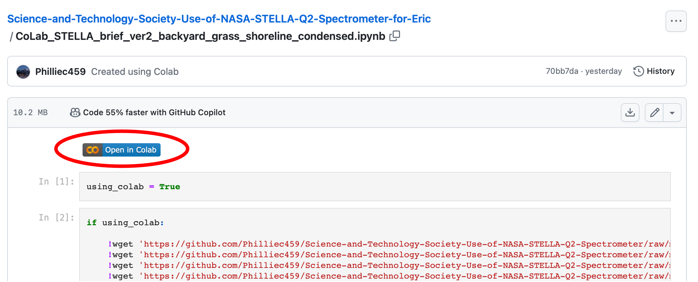
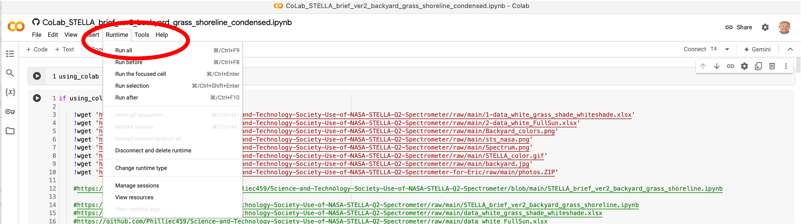

# Open-Source-Petrophysics
A comprehensive Open Source repository for Petrophysics, providing tools, scripts, and resources for analyzing subsurface data. Ideal for geoscientists, engineers, and researchers working with porosity, permeability, and other petrophysical properties. Join us in advancing the science of subsurface exploration and reservoir characterization.

We have created this GitHub repository titled **Open-Source-Petrophysics** where we will be sharing specialized petrophysical tools, primarily written in Jupyter Notebooks, to document and streamline various processes. This repository will also include example datasets, and each notebook will feature links to run the code directly in Google Colab, allowing users to execute the notebooks without needing Python installed locally. 

We recently conducted a course using Colab, and it performed admirably. You can explore some of the Colab examples from that course on this [GitHub repository](https://github.com/Philliec459/Launchpad-for-STS-Processing-of-STELLA-Spectrometer-Landsat-and-PACE-Ocean-Data), where the notebooks can be launched directly from the README.md page. While Colab is a great tool, there are other options like Binder, Kaggle, SageMaker, and Docker that might be even better for certain use cases.

The goal of the Open-Source-Petrophysics repository is to consolidate various petrophysical tools and scripts into a focused, well-documented resource. Initially, the repository will serve as a launchpad for tools designed with one or two specific objectives, making them easy for others to try out and build upon. Over time, we’ll also develop more comprehensive workflows, like those we have shared in this [repository](https://github.com/Philliec459/Jupyter-Notebooks_for-Characterization-of-a-New-Open-Source-Carbonate-Reservoir-Benchmarking-Case-St).

---
Below are some topics for the petrophysical tools we are developing. Any topic highlighted in blue is a hyperlink to a python Colab-ready Jupyter Notebook accessible from that link. These notebooks can be run directly in the Colab environment using an ordinary web browser. As we develop more notebooks, the number of blue links will increase.

Clicking a link will first open the Jupyter Notebook in GitHub. Press the 'Open in Colab' button in the upper left corner to launch the notebook in Colab. While in Colab, the notebook will automatically load the necessary data files and any required python libraries. Ensure that you are logged into your Google account by checking the upper right corner of the webpage. If not, log in before running Colab. To execute the notebook, go to the top title bar of Colab, click on the 'Runtime' tab, and select 'Run all.' The notebook will upload all necessary data files and run the Python code. The process may take a few minutes, but we've tested it in our environment, and Colab usually works fine. Once finished, we recommend ending your Colab session by clicking 'Disconnect and delete runtime' in the 'Runtime' tab. That's it.y works fine. When finished, we suggest that in the **"Runtime"** column, click on **"Disconnect and delete runtime"** to end your CoLab session. That is it. 

**Petrophysical Analysis**
- [Read in las file, explore data](https://github.com/Philliec459/Open-Source-Petrophysics/blob/main/Simple_Petrpphysical_Workflow/1_Read_LAS_Explore_Data.ipynb) We use lasio to read in the las files.
- [Read in las file and create a Depth Plot](https://github.com/Philliec459/Open-Source-Petrophysics/blob/main/Simple_Petrpphysical_Workflow/2_Read_LAS_Depth_Plot.ipynb) using matplotlib.
- [Neutron-Density Chartbook Porosity calculation using Knn](https://github.com/Philliec459/Open-Source-Petrophysics/blob/main/Simple_Petrpphysical_Workflow/3_Read_LAS_Chartbook_Porosity.ipynb)
- Refine saturation calculations using interactive Pickett plots with Panel interactive widgets. 
- Calculate Clay Bound Water and Qv for Waxman-Smits saturation analysis using Panel interactive widgets.
- [Python-based optimization for lithology estimation based on the original work of Ruben Charles](https://github.com/Philliec459/Open-Source-Petrophysics/blob/main/Simple_Petrpphysical_Workflow/rubens_optimization_methods.ipynb) 

**Permeability and Core Data Interrogation**
- [Convert routine core analysis Kair to Klinkenberg permeability](https://github.com/Philliec459/Open-Source-Petrophysics/blob/main/Klinkenberg/Klinkenberg_Perm_GitHub.ipynb)
- [Create Relative Permeability curves using rock/fluid properties with Panel](https://github.com/Philliec459/Open-Source-Petrophysics/blob/main/Relative_Permeability/RelPerm.ipynb)
- Permeability estimation using KNN, ...
- [View Clastic Thin Section photomicrographs from selected Porosity-Permeability samples using Altair](https://github.com/Philliec459/Open-Source-Petrophysics/blob/main/Clastic_Poro-perm_Thin_Sections/Clastic_poro_perm_thinsections_Altair.ipynb)
- [View Carbonate Capillary Pressure curves from selected Porosity-Permeability samples using Altair](https://github.com/Philliec459/Open-Source-Petrophysics/blob/main/Altair_Creeat_Pc_Interrogation_RosettaStone.ipynb). This notebook creates the HPMI Pc curves from the Thomeer parameters prior to the interactice visualization. 
- [Interactive Thomeer parameter analysis from High Pressure Mercury Injection data](https://github.com/Philliec459/Open-Source-Petrophysics/blob/main/Thomeer_from_Clerke_spreadsheet/Thomeer_from_Pc_curve_fit_auto-use-picks-Auto-Put_on_GitHub_read_Edspreadsheet_ver2.ipynb)
- [Chicheng Xu's lognormal Gaussian method used to derive Gaussian fit parameters to model HMPI data](https://github.com/Philliec459/Open-Source-Petrophysics/blob/main/Gaussian_Clerke_Spreadsheet/Panel_Bvocc_ver6_GitHub_colab.ipynb)
- Evaluation of various unsupervised Cluster analysis techniques with different elbow type methods.
- Rock Typing and the creation of full pore system **Petrophysical Rock Types**.

**Field Studies**
- Use of Thomeer parameters to estimate well log and 3D model saturations.
- Free Water Level (**FWL**) search using Capillary Pressure data.
- Free Water Level search results from individual wells used to create a FWL surface for 3D modeling of saturations.
- Calculate Reservoir Fluid properties and IFT*cos(theta) for carbonate and clastic reservoirs characterization projects. IFT*cos(theta) for carbonates is much lower than for clastic reservoirs. 
- Create field maps with interactive links to well-by-well dynamic data (pressure and production) for better understanding of the productive characteristics of your reservoir. 

**Workflows**
- Comprehensive workflow for clastic reservoir characterization
- Comprehensive workflow for carbonate reservoir characterization
- Interactive workflows for Waxman-Smits saturation analysis
- Interactive Passey methods used in unconventional well log analysis

**Miscellaneous**
- [Create an NMR logs from echo trains created from bin porosities and then process these echo trains with added noise for the T2 distribution.](https://github.com/Philliec459/Open-Source-Petrophysics/blob/main/NMR_Echo_Train_Simple_T2_Inversion_Example/NMR_echo_train_processing.ipynb) This approach offers an introductory understanding of converting time-domain echo train data to the T2 domain through T2 inversion. While the process is somewhat circular, real echo trains can be used instead. During this process, the user can introduce random noise, stack the echo trains to reduce some of this noise, and then process the stacked echo trains to generate an NMR log. This method serves as an effective educational tool for NMR logging.

---
---
## **HOW TO RUN JUPYTER NOTEBOOKS IN COLAB:**
1) If you click on the Jupyter Notebook links that we have provided, then you will see the following type of image while you are still in GitHub. Click on the banner **"Open in CoLab"** at the top. This will then open the notebook in Google CoLab. Look to the far upper right corner of the web page to make sure that you are logged into your Google account. If not, then login before trying to run CoLab. 

2) On the top title bar of CoLab there is a label called **"Runtime"**(second image below). Click on this and then click on **"Run all"**. That is it. The notebook should upload all of the data files, load the necessary python libraries and run the python notebook. It could take a few minutes, but we have tested each notebook in this environment, and CoLab works well most of the time. If you have any issues, then click on **Run all** again. That should take care of the problem unless the CoLab network is extremely busy. 

3) When finished, then we suggest in the **"Runtime"** tab, click on **"Disconnect and delete runtime"** to end your CoLab session. This will delete all of the data and terminate the runtime. 

